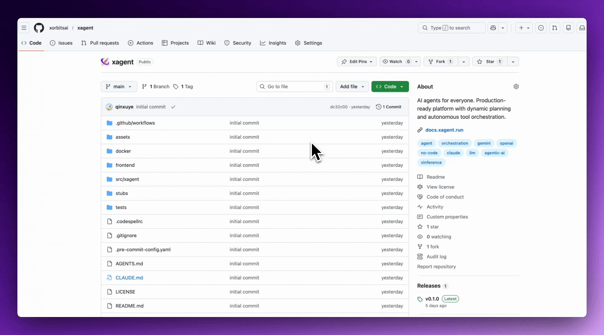

---

## What is Xagent?

**Describe tasks. Not workflows.**

**No more flowcharts.**
**No more rigid automation.**
**Just tell Xagent what you want.**

---

## ⚡ The Problem

**Workflow builders are rigid. They break when requirements change.**

- You map every decision branch manually
- You orchestrate tools by hand
- You maintain fragile flow diagrams
- You re-engineer when logic changes

---

## 🎯 The Xagent Way

**With Xagent, you describe the outcome — not the steps.**

- Plans the task dynamically
- Decomposes into executable steps
- Selects the right tools automatically
- Executes, evaluates, and iterates

---

## 🚀 What You Can Build

With Xagent, you don’t design workflows. You describe the task. That’s it.

**Just define what you want done — and Xagent plans, decomposes, selects tools, and executes.**

### Build Anything You Can Describe:

| Domain | Examples |
|--------|----------|
| **Content Creation** | Automated PPT generation, marketing posters, creative design assets |
| **Research & Analysis** | Deep analysis reports, research summaries, data synthesis |
| **Enterprise Automation** | AI copilots for internal teams, knowledge assistants, task automation |
| **Business Intelligence** | Data reporting automation, SaaS features, multi-step reasoning systems |
| **Knowledge Work** | Document processing, information extraction, structured outputs |

**If you can clearly describe the goal, Xagent can turn it into an executable system.**

All powered by one unified runtime.

---

## 🚀 Quick Start

**Get started in 3 minutes**

### 1️⃣ Clone and configure

```bash
git clone https://github.com/xorbitsai/xagent.git
cd xagent
cp example.env .env
```

### 2️⃣ Start with Docker

```bash
docker compose up -d
```

### 3️⃣ Open in browser

```
http://localhost:80
```

**Default administrator credentials:**
- Username: `administrator`
- Password: `administrator`

That's it. Xagent is now running.

---

## ✨ Core Features

### 🧠 Dynamic Planning Engine

Unlike traditional workflow tools, Xagent plans tasks dynamically at runtime.

- Automatic task decomposition
- Plan → Execute → Reflect loops
- Conditional branching
- Multi-step reasoning

**No static flows. No brittle chains.**

---

### 🔌 Tool & Model Orchestration

Xagent connects to your entire stack:

- OpenAI, Anthropic and other LLM providers
- Self-hosted models via Xinference
- External APIs
- Knowledge bases (RAG)
- Internal enterprise systems

It selects and orchestrates tools automatically during execution.

---

### ⚡ Instant Execution Mode

For simple use cases, run tool-enabled LLM calls instantly.

- No configuration overhead
- Chat-style assistants
- Embedded AI features

**Start simple. Scale when needed.**

---

### 📊 Observability & Control

Built for real production use:

- Task lifecycle tracking
- Token usage monitoring
- Execution state management
- Multi-user support

**Operate agents like real systems — not demos.**

---

## Stay Ahead

Xagent is actively developed and rapidly evolving.



**Follow our progress:**
- ⭐ Star us on GitHub to stay updated
- 🐛 Report issues and request features
- 💬 Join our community discussions

---

## 🏢 Deployment Options

Xagent supports:

- Self-hosted deployment
- Private cloud environments
- On-premise enterprise infrastructure
- Docker-based setup

**You control your models, data, and infrastructure.**

---

## 🏗 Architecture Overview

Xagent separates core responsibilities:

| Layer | Responsibility |
|-------|----------------|
| **Agent Definition** | Intent & constraints |
| **Planning Engine** | Dynamic decomposition |
| **Execution Runtime** | Orchestration layer |
| **Tool Layer** | Integrations & actions |
| **Model Layer** | LLM & inference backend |

**This architecture enables:**
- Stability under complex reasoning
- Safe iteration
- Horizontal scalability
- Long-term maintainability

---

## 🔍 Not a Workflow Builder

**Xagent is not:**
- A drag-and-drop flow editor
- A static template engine
- A chatbot wrapper

**Xagent is:**
- A dynamic task execution engine
- An autonomous planning system
- A foundation for building real AI agents

---

## 🤝 Contributing

We welcome developers, product builders, and researchers.

Open issues. Submit PRs. Help shape the future of AI agents.

---

## 📄 License

This project is licensed under the Xagent Source License - see the [LICENSE](LICENSE) file for details.
