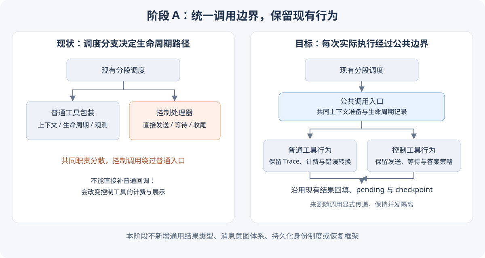
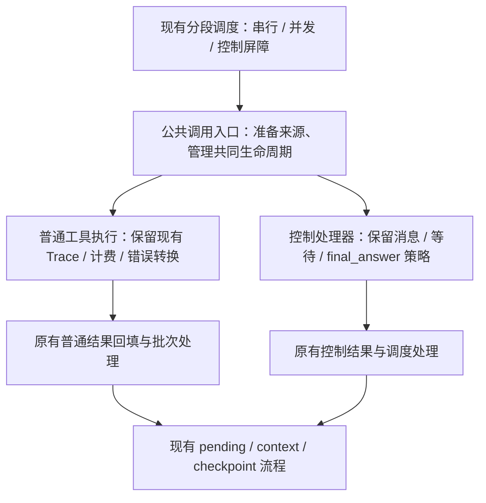

# 阶段 A：统一工具调用生命周期边界

> 状态：阶段 A 已在本 worktree 实现并通过局部回归；2026-09-06。
>
> 工作分支：`ref/tool-call-lifecycle`；基线：`origin/main` 的 `39004299c`。
>
> 本 worktree 包含阶段 A 的 ReAct 改动、回归测试及配套文档。3.2 PR #2145 是后续接入方，不属于本阶段实现范围。

## 1. 要解决的问题

ReAct 在分段调度时，把普通工具送入 `_execute_tool_safely`，把控制工具直接送入 `_handle_control_tool`。前者包含调用上下文准备、生命周期记录与 runtime 回调，后者分别处理发送、记账、等待和结束。

这使“如何调度工具”同时决定了“是否经过公共生命周期边界”。3.2 把执行保障接在普通工具的 Trace 路径上后，控制工具便无法获得相同保障。

**阶段 A 的目标：普通与控制调用经过同一个明确的生命周期边界，同时保留各自的工具行为、调度结果和现有外部表现。**

完成标准不是所有代码都合并，而是共同的上下文准备和生命周期职责有明确归属，不再因控制分支而被绕过。后续 3.2 可以在这个边界接入执行保障，无须借用普通工具专用的 Trace 回调。

## 2. 代码依据

| 位置（基线 main） | 现状与设计约束 |
| --- | --- |
| [react.py:2946](../../src/xagent/core/agent/pattern/react/react.py#L2946) `_execute_pending_tool_calls` | 普通与控制分支选择不同执行入口；保留现有串行、并发、控制屏障 |
| [react.py:3593](../../src/xagent/core/agent/pattern/react/react.py#L3593) `_execute_tool_safely` | 混合上下文准备、ledger、执行、异常处理与普通工具回调；只抽取共同职责 |
| [react.py:2292](../../src/xagent/core/agent/pattern/react/react.py#L2292) `_handle_control_tool` | 包含消息发送、工具结果、等待状态、最终答案和限制策略；不整体重写 |
| [react.py:2650](../../src/xagent/core/agent/pattern/react/react.py#L2650) `_backfill_result` | 普通工具已有按顺序回填协议结果的路径；无需强制与控制分支合并 |
| [runtime.py:878](../../src/xagent/core/agent/runtime.py#L878) `on_tool_start` | 同时计费、发 Trace、创建 span；不能直接让所有控制调用复用 |
| [runtime.py:741](../../src/xagent/core/agent/runtime.py#L741) `send_message` | 已有 metadata 和 outbound callback；可沿用承载调用来源 |
| [react.py:2699](../../src/xagent/core/agent/pattern/react/react.py#L2699) `_pause_for_tool_results` | 多个普通工具可合并成一个问题；来源应保留多个调用，不能假装只有一个 |
| [dag.py:146](../../src/xagent/core/agent/pattern/dag/dag.py#L146)、[auto.py:224](../../src/xagent/core/agent/pattern/auto/auto.py#L224) | 转发消息参数；检查来源能否沿既有 metadata 透传，只修实际丢失处 |

ReAct 保留 `final_answer`、`send_message`、`ask_user_question` 的控制 schema。仓库中的 `AskUserQuestionTool` 与控制处理器的行为不等价，因此本阶段不把控制工具改为 `_find_tool` 注册表查找。

## 3. 最小方案

### 3.1 一个公共入口，不新增执行框架

在现有 ReAct 模块内抽出一个直接的内部调用入口。串行路径、并发批次中的每个实际执行调用，以及控制路径都经由它进入具体行为。保留 `_next_segment` 和批次调度方式。

公共入口承担：

- 按现有规则准备调用 ID、关联内容和可用的 step/turn 来源；不得在共享 runtime 上设置可变的“当前调用”。
- 承担普通与控制调用共有的开始、完成、失败或中断记录职责，使用现有 ledger 和状态含义。
- 把具体行为返回的现有结果交回原调度路径；让需要向上传播的异常继续传播。

具体行为仍然分支处理。普通工具的查找、参数脱敏、执行与业务异常转换留在普通路径；控制处理器保留限制检查、消息发送、空答案拒绝、等待状态和最终答案收尾。

生命周期记录的迁移以现有分支为单位：迁移了某项记录，才移除原处对应写入，避免重复终态记录。对特殊拒绝、等待等结果沿用其明确语义，不能用统一的“返回即成功”规则覆盖。

**不以集中所有 ledger/context/pending 写入为目标。** 工具调用记录与给模型回填工具结果是不同职责；普通批次仍按输入顺序回填，控制路径可以保留自己的结果应用。

没有实际执行的尾部取消、协议拒绝等路径仍按原规则处理，不为满足“统一入口”而把它们伪装成一次已开始的工具执行。

### 3.2 生命周期与普通工具观测分开

现有 `on_tool_start/end/error/cancelled` 不只是生命周期通知，还承担普通工具的 Trace、计费和 span 行为。

公共边界不能无条件调用这些回调。阶段 A 保留它们在普通工具路径中的既有触发时机；控制调用不因此增加账单、普通工具卡片或 span。共同的执行与记录边界不依赖某个观察订阅者是否存在。

不新增空的 hook 注册器、事件总线、执行器接口或 observer 框架。3.2 有实际持久化消费者时，再把所需的执行保障直接接入公共边界。

异常处理同样保持区别：普通工具业务异常仍转换为现有错误结果；控制发送失败及原本会向上传播的基础设施异常不能被新的外层捕获逻辑吞掉。取消继续沿原有路径传播。

### 3.3 沿现有结构传递必要来源

阶段 A 继续使用现有 `tool_call`，不引入完整 `CallContext`，不提前添加 attempt、batch、scope、origin execution 等占位字段。

控制行为已经接收 `tool_call`；公共入口准备后的调用来源应沿消息发送传下去。优先沿现有 metadata 承载 provider tool-call ID、工具名以及现有可用的 step/turn 关联信息，不复制工具参数或整份调用对象到消息中。

对普通工具聚合的问题，保留各来源调用的有序关联信息；优先复用已有 requests 数据，避免另造“交互组”实体。这里的 provider ID 仅用于关联，不承诺跨批次唯一或重启幂等。

消息来源的具体键名和结构在实施时对照现有消费者确定，保证生产者、DAG/Auto 转发和 callback 读取一致。现有非工具消息保持原发送方式，不强制补造工具身份。

本阶段不改变消息 ID 生成规则，也不改变 WebSocket 消息类型、已有字段含义和表单结构。

### 3.4 保留现有结果和等待语义

不引入通用 `CallOutcome`、调度指令枚举或消息意图体系。继续使用现有返回值和控制状态判断。

`ask_user_question` 的“发布问题调用完成”与 Agent 的“等待用户回答”可以同时成立。普通工具已有的 `waiting_for_user` ledger/结果语义也保持，不为了统一状态名称改变行为。

不让提问工具变成长时间挂起的协程，不在用户回答时为同一个 provider 调用额外追加第二份工具结果。

## 4. 实施顺序与文件范围

| 顺序 | 工作 | 主要文件 |
| --- | --- | --- |
| 1 | 补齐受影响行为基线，确认现有回调、账单、结果和取消表现 | `tests/core/agent/test_react.py` 及相关既有测试 |
| 2 | 抽取公共入口和共同上下文准备；逐分支迁移共同生命周期记录 | `core/agent/pattern/react/react.py` |
| 3 | 沿消息路径传递必要来源，核对适配器透传 | ReAct、`runtime.py`；仅必要时修改 `dag.py` / `auto.py` |
| 4 | 验证串行、并发、控制分支均经过边界，且兼容行为保持 | 对应现有测试模块 |

原则上不需要修改 checkpoint schema、事件存储、WebSocket 持久化服务或前端。若实施发现必须修改这些部分，先说明具体依赖并重新讨论范围，不顺带扩展本阶段。

## 5. 验收矩阵

| 场景 | 阶段 A 应验证 |
| --- | --- |
| 普通成功、失败与三个控制工具 | 实际执行都经过公共边界；生命周期记录无遗漏、无新增重复终态 |
| 普通工具 Trace / 计费 / span | 数量和触发行为保持 |
| 控制工具观测 | 不新增普通工具卡片、账单或 span |
| 非等待 send_message | 发完继续后续调用；消息带有本次调用来源 |
| ask_user_question / 等待型 send_message | 原 waiting payload、表单、等待与回答恢复行为保持 |
| final_answer | 结果只回填一次；空答案拒绝和尾部 pending 清理保持 |
| 并发普通工具 | 来源不串；原 batch 回填顺序与中断时已完成结果保留 |
| 发送或基础设施失败 | 按原约定传播，不变成成功或被包装成可自动重试的业务错误 |
| 用户取消、交互禁用与委派限制 | 原取消传播、pending 整理和限制策略保持 |
| 多工具合并提问 | 保留各调用关联，不因完成顺序改变来源顺序 |
| DAG / Auto / preview | 现有发送路径可用，所需来源不丢失；不新增真实数据库依赖 |
| 旧 checkpoint | 按现有结构恢复，不要求新增字段 |

优先补充能证明公共边界和来源传递行为的回归测试，并复用已有行为用例。不仅测试“包装函数被调用”，还要检查真实输出、终态、异常和并发结果。

## 6. 后续 3.2 的边界

阶段 A 提供统一接入位置，**不宣称修复消息持久化幂等性**。

3.2 后续需要使用其已有 attempt 身份接入公共边界，并处理稳定消息 ID、提交后 checkpoint 落后、恢复 run/step 变化等已确认问题。具体提交方式和所需类型在该阶段确定，优先复用已有事件、交互和 checkpoint 结构。

本设计不要求 checkpoint 全量由事件重建，不新增交互状态机、通用外部工具对账机制或另一套调用状态存储。

## 7. 实现与验证记录

实际业务修改集中在 `core/agent/pattern/react/react.py`：控制调用进入现有 `_execute_tool_safely`，共用调用准备、running 记录及异常收尾；普通工具原有的回调和业务异常转换保持。控制处理器继续写入各自语义明确的终态和工具结果，公共入口只为尚未记录终态的失败补齐收尾。

准备上下文时使用执行副本；控制处理器仍接收原 pending 对象，保留按对象身份取消其他调用的语义，也不把 step/turn 写回已保存的 checkpoint。最终答案已记为完成后若 checkpoint 失败，保留已完成记录并传播异常。

单个控制消息的 metadata 增加 `tool_call_id`、`tool_name` 和可用的 step/turn 来源。聚合提问通过 metadata 的 `tool_calls` 有序列表保留各调用来源，不携带工具参数。DAG/Auto 现有转发已满足要求，因此未修改其接口或实现。

在更新到 `origin/main` 的 `39004299c` 后，本地验证：

- ReAct 主测试、分段与并发、真实工具并发、结构化提问、clarification、runtime、DAG、Auto，共 **531 passed**。
- 新增 9 项参数化回归实例，覆盖普通与三个控制调用的生命周期/计费边界、发送失败与取消、聚合来源顺序、最终 checkpoint 失败后保留完成结果。
- 修改的 Python 文件通过 Ruff 格式和 lint 检查。
- ReAct 文件通过项目配置下的 mypy 定向检查（`--follow-imports=silent`）；未运行全仓类型检查。

没有改变 checkpoint schema、WebSocket 持久化、前端或事件存储。上述验证是阶段 A 的行为回归，不是 3.2 持久化幂等性或崩溃恢复验收。
