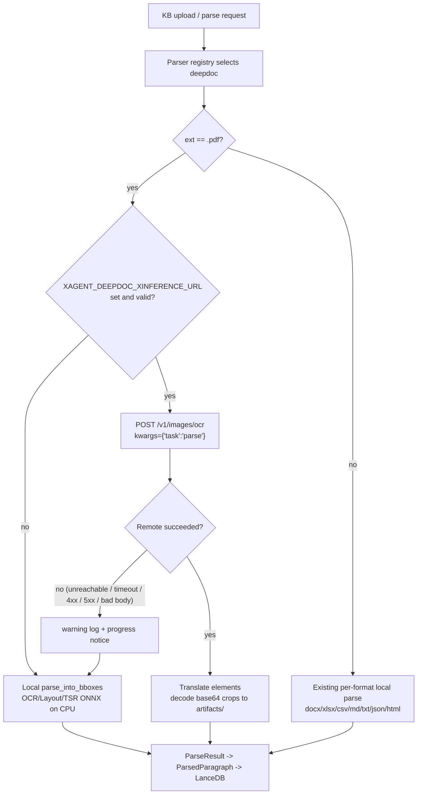
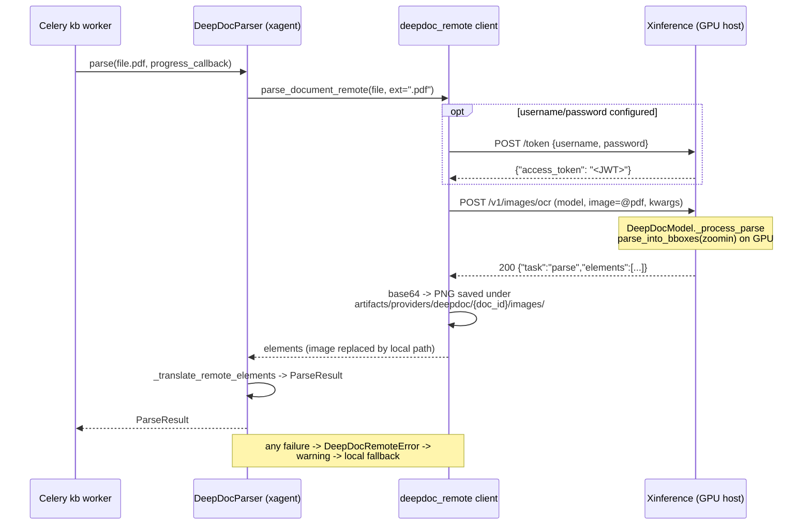

# DeepDoc Remote Parsing (Xinference GPU Offload)

## 1. Background

xagent's KB/RAG document parsing uses DeepDoc via the external `deepdoc-lib==0.2.2`
package. The PDF pipeline (OCR detection/recognition, layout analysis, table
structure recognition) runs entirely as local ONNX inference and is the dominant
cost on CPU-only deployments — large documents take minutes.

Two facts shape this design:

- `deepdoc-lib` 0.2.2 has **no usable remote inference path**. The
  `TENSORRT_DLA_SVR` hook in `vision/layout_recognizer.py` imports
  `deepdoc.vision.dla_cli`, a module that does not ship in the package.
- Xinference now serves the whole pipeline. [xorbitsai/inference#5299][pr]
  added `task="parse"` to the DeepDoc OCR model, which runs
  `PdfParser.parse_into_bboxes()` server-side over an entire PDF and returns
  ordered document elements. That is the same function xagent calls locally, so
  remote and local results are the same kind of object rather than two things
  that have to be reconciled.

[pr]: https://github.com/xorbitsai/inference/pull/5299

## 2. Goals

- Users run DeepDoc PDF parsing on their own GPU machine through Xinference.
- xagent opts in purely through environment variables. Once configured, PDF
  parsing is routed to the remote service in **one** request.
- On remote failure, parsing automatically falls back to local inference so
  ingestion never breaks.
- Zero user-facing change: no new `ParseMethod`, no frontend change. Existing
  knowledge bases already set to `deepdoc` get the speedup for free.

## 3. Non-goals

- **Non-PDF formats.** `task="parse"` renders and merges a PDF; it consumes
  nothing else. `.docx`, `.xlsx`, `.xls`, `.csv`, `.md`, `.txt`, `.json` and
  `.html` are parsed locally whether or not a remote server is configured. Those
  paths are cheap CPU parsing, not ONNX inference, so there is little to gain —
  and attempting them remotely would only buy a failed round trip before the
  same local parse ran anyway.
- Per-KB or per-request remote configuration (global env only).
- Asynchronous job submission with progress polling (this is a single
  synchronous call).
- Any change to `deepdoc-lib` itself.

## 4. Flow

### 4.1 Routing and fallback



### 4.2 Sequence (remote success path)



## 5. Configuration (xagent side)

| Environment variable | Required | Default | Notes |
|---|---|---|---|
| `XAGENT_DEEPDOC_XINFERENCE_URL` | yes, to enable remote | unset (= local mode) | Xinference base URL, e.g. `http://gpu-host:9997`. Must be a bare origin (a path is fine): a query string, a fragment, or embedded `user:password@` credentials are all rejected, and a rejected value logs a warning and **parses locally** rather than failing. Pasting a console URL therefore silently gets you local parsing — check the log if remote appears not to engage. Trailing slashes are stripped. |
| `XAGENT_DEEPDOC_XINFERENCE_MODEL_UID` | no | `DeepDoc` | The `model` form field; must name a launched DeepDoc model. |
| `XAGENT_DEEPDOC_XINFERENCE_API_KEY` | no | falls back to bare `XINFERENCE_API_KEY`, then no auth header | Sent directly as the bearer token. |
| `XAGENT_DEEPDOC_XINFERENCE_USERNAME` / `_PASSWORD` | no | unset | Exchanged for a JWT at `POST /token`. Takes precedence over the API key when the username is set and the password is not blank. The password itself is sent unstripped, since whitespace can be significant in a secret, but a whitespace-only value is treated as unset so it cannot shadow a working API key. |
| `XAGENT_DEEPDOC_XINFERENCE_TIMEOUT_SECONDS` | no | `1800` | Read and write timeout for one whole-document parse, matching the `timeout=1800` precedent in deepdoc-lib's own MinerU API client. Connect and pool stay pinned at 10 s and the token exchange at 30 s, so an unreachable host fails fast instead of hanging for the parse budget. |

Authentication is whichever of the two the cluster uses: a username/password
pair mints a short-lived JWT, an API key is sent as-is, and a cluster started
without authentication needs neither. A failed token exchange is a remote
failure like any other — it falls back locally, and it happens before the upload
so a rejected credential never costs a PDF's worth of bandwidth.

There is deliberately **no fallback toggle**: fallback is always on, which is what
makes the switch transparent. A malformed URL degrades to local mode with a
warning rather than failing every parse.

## 6. Server API contract

```
POST {base_url}/v1/images/ocr
Authorization: Bearer <JWT or API key>   # omitted when unauthenticated

Request (multipart/form-data):
  model   str     required            launched DeepDoc model UID
  image   binary  required            the PDF itself, part typed application/pdf
  kwargs  str     required            JSON object, see below

kwargs fields:
  task         str  required          must be "parse"
  zoomin       int  default 3         render scale, capped at 6
  image_scope  str  default table_figure    table_figure | all | none

Response 200 application/json:
{
  "task": "parse",
  "elements": [
    {
      "type": "title",                 // text | title | table | figure
      "text": "Sample Document",       // complete HTML for tables
      "image_base64": "…",             // OMITTED when the element has no crop
      "metadata": {"x0": 70.666, "x1": 256.333, "top": 77.333, "bottom": 96.333,
                   "page_number": 1, "layout_type": "title",
                   "layoutno": "title-0", "col_id": 0,
                   "positions": [[1, 70.7, 256.3, 77.3, 96.3]]}
    }
  ]
}

Errors: 400 non-PDF upload, invalid kwargs, or a render exceeding the size
        budget; 401 auth failure; 500 inference failure.
```

Details the client codes against, all verified against a live server:

- `type` is the detected layout type and `metadata.layout_type` repeats it.
- Tables carry complete HTML in `text`, including `<caption>` and `<th>`.
- `image_base64` is **omitted entirely** for elements without a crop rather than
  sent as `null`, so its absence is the normal case and not an error. With the
  default `image_scope`, only tables and figures have one — which is exactly
  what the downstream translator consumes, so the client requests
  `table_figure` explicitly rather than relying on the default staying put.
- Coordinates in `metadata` **accumulate across pages**, so `top`/`bottom` are
  document-wide rather than page-relative. This matches local
  `parse_into_bboxes` output.
- `col_id` is present only on elements the pipeline assigned to a column, so it
  can legitimately be missing (4 of 52 elements on the reference document). The
  translator defaults those to column 0, as the local path does.
- `zoomin` outside 1..6 is refused with a 400, so the client rejects it before
  uploading rather than discovering it afterwards. The local fallback accepts
  any value, so the caller's request is still honored there.
- `pages` and `dpi` are rejected for `parse`. Size limits are enforced against
  the largest scale a run can reach: 400 when one page would peak above 200 MP
  or the document above 1 GP, because a render that finds no text is retried at
  three times the zoom, up to 9.

## 7. Parity with local parsing

`task="parse"` calls the same `parse_into_bboxes()` xagent calls locally, so
this is a question of measurement rather than of design. The GPU server's output
was compared against local CPU `deepdoc-lib` on the same PDF
(`tests/resources/test_files/test.pdf`):

| Property | Result |
|---|---|
| Element count | 52 vs 52 |
| Split across kinds | 48 text segments, 2 tables, 2 figures on both sides |
| Type breakdown | `{title: 8, text: 40, table: 2, figure: 2}` on both sides |
| Element text | 0 differences, verbatim — including both tables' HTML |
| `layout_type` | 0 differences |
| `positions` structure | 0 differences; every page number matches |
| Figure captions | identical |
| Coordinates | max delta 0.0046 px across 208 compared values; none above 0.1 px |
| `col_id` | 6 elements differ — non-deterministic, see below |

Text, classification, ordering and table HTML come back identical. The only two
variations are sub-pixel coordinate noise and `col_id`.

**Coordinates agree to within 0.005 px.** Of 208 compared values (`x0`, `x1`,
`top`, `bottom` across all 52 elements) 14 differ at all, the largest by
0.004557 px and the average by 0.001 px. Nothing exceeds 0.1 px. This is
last-digit floating-point divergence between the GPU and CPU ONNX runtimes;
`positions` drive PDF highlight boxes, where it is far below one screen pixel.

**`col_id` is non-deterministic, and locally so.** `_assign_column` clusters
x-coordinates with KMeans whose initialization is unseeded (it also emits
`ConvergenceWarning: Number of distinct clusters (1) found smaller than
n_clusters` on this document). Running local CPU parsing twice back to back in
one process flips *the same six elements* between column 2 and column 3, with
zero text and zero coordinate differences between those two local runs. So the
remote path is exactly as faithful to local output as local output is to itself,
and this integration does not try to correct the instability.

One consequence worth knowing when comparing runs: because reading order is
reconstructed from the column assignment, a `col_id` flip can also swap the
order of elements sharing a line on a multi-column page. Comparing two runs
element-by-element positionally will then report text differences that are
really just a reordering. Compare by content, or normalize the order, before
concluding that text diverged.

**Remote segment metadata carries five extra keys.** The server reports each
element's coordinates in `metadata`, and those are merged through, so a remote
text segment additionally carries `x0`, `x1`, `top`, `bottom` and `layoutno`
where a local one carries none of them. Local parsing keeps those coordinates
only inside `positions`. This is deliberate — discarding them would lose
information the server took the trouble to send — but it does mean "equivalent
to local output" in section 8 means the same elements with the same text,
classification and `positions`, not byte-identical metadata dicts.

The earlier design of this document listed a capability gap — no table HTML, no
images, no paragraph merging, no cross-page coordinates — that applied to an
OCR-stitching approach built on the per-page `task="ocr"`. `task="parse"`
provides all four, so that gap no longer exists and the client makes a single
request with nothing to stitch.

## 8. Acceptance criteria

1. **Env unset** — fully local, with two deliberate differences from the
   pre-integration behavior: `ParseResult.metadata` now carries
   `deepdoc_backend="local"` on every format, and the Office magic-byte check
   was hoisted above the local dispatch, so an `.xlsx` whose BytesIO conversion
   failed is now validated where it previously went straight to
   `_parse_xlsx_rows`. Parsed content itself is unchanged.
2. **Non-PDF, env set** — parsed locally with **zero HTTP requests**.
3. **PDF, env set, service healthy** — parsed remotely in one request; local
   ONNX models are **not loaded** and no ModelScope download is triggered;
   text segments, tables, figures, their metadata, `positions` and saved images
   are equivalent to local output within the bounds of section 7 — same element
   count, same classification, same pages — so downstream
   chunking/embedding/retrieval is unaffected; result metadata carries
   `deepdoc_backend=remote`.
4. **PDF, env set, service unreachable / timing out / 4xx / 5xx / bad body /
   failed token exchange** — a warning is logged, a progress notice is emitted,
   parsing falls back to local and succeeds, and metadata carries
   `deepdoc_backend=local`.
5. **Malformed URL** — degrades to local mode with a warning; no parse fails.
6. **Progress** — remote mode reports "Uploading…" and "Remote parse finished";
   on fallback the failure notice is followed by the normal local progress
   stream.
